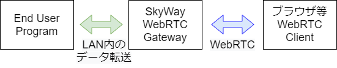
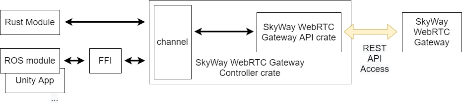

# SkyWay WebRTC Gateway Control Module

[SkyWay WebRTC Gateway](https://github.com/skyway/skyway-webrtc-gateway) 操作用のモジュールである。

SkyWay WebRTC Gatewayを利用すると、LAN内の通信をWebRTCをWebRTCに変換してインターネット上に転送することができる。

SkyWay WebRTC GatewayはREST APIで操作することができ、このAPIをRustから叩くためのラッパーが [WebRTC Gateway API crate](https://github.com/nakakura/webrtc_gateway_controller) である。
このcrateはlow levelの実装であり、REST APIの実行順序などのドメイン知識がなければ、SkyWay WebRTC Gatewayを利用することができない。

SkyWay WebRTC Gateway Control Module crateはこれをラッピングするhigh levelなcrateとして提供する。
外部プログラムに対しては、[tokio::sync::mpsc](https://docs.rs/tokio/1.10.1/tokio/sync/mpsc/index.html) によるインタフェースでのJSONメッセージ交換を介して、簡単に操作できるようにする。
Rust製プログラムや、FFIを介しての外部プログラムからの利用を想定している。

JSONメッセージに関するドキュメントは現在作成中である。

SkyWay WebRTC Gatewayの処理は、サーバを介して行うため、非同期的に実行するよう想定され設計されている。
但し利用者側のプログラムによっては同期的にアクセスの方が簡便なため、これをラッピングする本crateでは、同期的に利用可能な2つのチャンネルを提供する。

- 操作用のSender channel
- イベント受信用のReceiver channel

Sender channelには、操作用のJSONメッセージと、一次的な戻り値を受け取るための[oneshotチャネル](https://docs.rs/tokio/1.10.1/tokio/sync/oneshot/index.html) を与える。

Receiver channelからは、SkyWayサーバでの処理完了後に受け取ることのできるイベントメッセージが返される
(相手側からの通信開始要求や、WebRTCセッション確立完了メッセージなど)。
